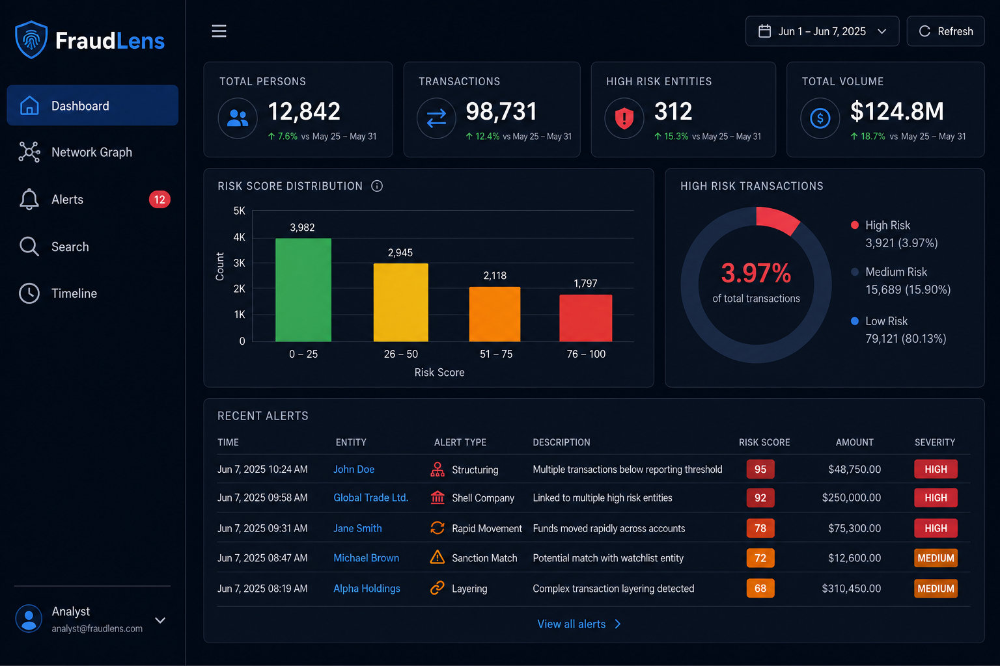

# FraudLens — Fraud Detection with CognoDB

A full-stack fraud detection application that uses **CognoDB** (Bolt/Cypher, Neo4j-compatible driver) to identify suspicious financial patterns through graph network analysis.



## Features

- **Dashboard** — Risk score distribution, transaction volume, high-risk person counts
- **Network Graph** — Interactive vis.js visualization of persons, accounts, transactions, devices, and IPs
- **Real-time Alerts** — Money laundering rings, shared devices/IPs, identity fraud patterns
- **Search & Investigate** — Search by person, account, or transaction with detail views
- **Transaction Timeline** — Chronological activity view with risk indicators

## Why a Graph Database?

Fraud is fundamentally about connections. A conventional relational database can store
customers and payments, but tracing circular fund movements or discovering several
identities that converge on the same device or IP address requires repeated self-joins
and application-side assembly. CognoDB lets FraudLens traverse those relationships
directly: a laundering loop becomes a multi-hop path query, and shared infrastructure
becomes an explicit relationship that can be scored and visualized.

## Architecture

```
┌─────────────────┐     REST/JSON      ┌──────────────────┐     Bolt/Cypher     ┌─────────────┐
│  React + Vite   │ ◄───────────────► │  FastAPI Backend │ ◄────────────────► │   CognoDB   │
│  vis-network    │                    │  neo4j driver    │                    │  Graph DB   │
└─────────────────┘                    └──────────────────┘                    └─────────────┘
```

## Data Model

### Node Types

| Label | Properties |
|-------|-----------|
| **Person** | id, name, email, ssn_hash, phone, risk_score (0–100), created_at |
| **BankAccount** | id, account_number, bank_name, account_type, balance, opened_date |
| **Transaction** | id, amount, timestamp, transaction_type, ip_address, device_id |
| **Merchant** | id, name, category, location, risk_score |
| **Device** | id, device_fingerprint, os, browser |
| **IPAddress** | id, ip, geolocation, is_proxy |

### Relationships

```
(Person)-[:OWNS]->(BankAccount)
(Person)-[:HAS_DEVICE]->(Device)
(Person)-[:USES_IP]->(IPAddress)
(Person)-[:PERFORMS]->(Transaction)
(Transaction)-[:FROM]->(BankAccount)
(Transaction)-[:TO]->(BankAccount)
(Transaction)-[:AT]->(Merchant)

# Detected fraud patterns (created by seed/analysis)
(Person)-[:SHARES_DEVICE_WITH]->(Person)
(Person)-[:SHARES_IP_WITH]->(Person)
(Transaction)-[:SUSPICIOUS_RELATION]->(Transaction)
```

### Entity Relationship Diagram

```
                    ┌──────────┐
                    │  Person  │
                    └────┬─────┘
         OWNS ───────────┼────────── HAS_DEVICE ──► Device
         │               │                              ▲
         ▼               │ PERFORMS                     │ SHARES_DEVICE_WITH
   ┌────────────┐        ▼                              │
   │ BankAccount│◄── FROM ── Transaction ── TO ──► BankAccount
   └────────────┘        │
                         ├── AT ──► Merchant
                         └── SUSPICIOUS_RELATION ──► Transaction

   Person ── USES_IP ──► IPAddress
   Person ── SHARES_IP_WITH ──► Person
```

## Key Cypher Queries

### 1. Money Laundering Ring Detection (multi-hop)

Detects circular high-value transfers between persons via bank accounts:

```cypher
MATCH (p1:Person)-[:OWNS]->(a1:BankAccount)<-[:FROM]-(t1:Transaction)-[:TO]->(a2:BankAccount)<-[:OWNS]-(p2:Person)
WHERE t1.amount > 10000 AND p1 <> p2
MATCH (p2)-[:OWNS]->(a3:BankAccount)<-[:FROM]-(t2:Transaction)-[:TO]->(a1)
WHERE t2.amount > 10000
RETURN p1, p2, t1, t2
```

### 2. Connected Fraud Patterns (awkward in relational DB)

Finds persons with multiple devices AND multiple IPs AND large transactions:

```cypher
MATCH (p:Person)-[:HAS_DEVICE]->(d:Device)
WITH p, collect(d.device_fingerprint) AS devices
WHERE size(devices) > 1
MATCH (p)-[:USES_IP]->(ip:IPAddress)
WITH p, devices, collect(ip.ip) AS ips
WHERE size(ips) > 3
OPTIONAL MATCH (p)-[:PERFORMS]->(t:Transaction)-[:AT]->(m:Merchant)
WHERE t.amount > 5000
RETURN p.name, p.risk_score, size(devices), size(ips), count(t)
```

## Quick Start

### Prerequisites

- Python 3.10+
- Node.js 18+
- A CognoDB instance ([cognodb.com](https://cognodb.com))

### 1. Configure Environment

Create a free **c0** CognoDB Cloud instance at
[console.cognodb.com/signup](https://console.cognodb.com/signup). Copy its `bolt+s://`
connection URI and the one-time password shown for the `cognodb` user.

```bash
cp backend/.env.example backend/.env
```

Edit `backend/.env`:

```env
COGNO_URI=bolt+s://db-xxxxx.databases.cognodb.cloud
COGNO_USER=cognodb
COGNO_PASSWORD=your_password
PORT=8000
```

### 2. Backend Setup

```bash
cd backend
python -m venv .venv

# Windows
.venv\Scripts\activate

# macOS/Linux
source .venv/bin/activate

pip install -r requirements.txt
```

### 3. Seed the Database

```bash
python -m scripts.seed
```

This creates roughly 140 nodes with three embedded fraud scenarios:
- **Ring A** — Circular money laundering ($15k–$50k transfers)
- **Ring B** — 5 aliases sharing one device, individual devices, and proxy IPs
- **Suspect** — High-value transfers linked to ring accounts

### 4. Start the API

```bash
uvicorn app.main:app --reload --host 0.0.0.0 --port 8000
```

API docs: http://localhost:8000/docs

### 5. Frontend Setup

```bash
cd frontend
npm install
npm run dev
```

Open http://localhost:5173

## Environment Variables

| Variable | Description | Default |
|----------|-------------|---------|
| `COGNO_URI` | CognoDB Bolt URI | `bolt://localhost:7687` |
| `COGNO_USER` | Database username | `cognodb` |
| `COGNO_PASSWORD` | Database password | — |
| `PORT` | API server port | `8000` |
| `CORS_ORIGINS` | Allowed frontend origins | `http://localhost:5173` |

## Project Structure

```
webxai/
├── backend/
│   ├── app/
│   │   ├── main.py              # FastAPI entry point
│   │   ├── config.py            # Environment settings
│   │   ├── database.py          # Connection pool + query helpers
│   │   ├── models/schemas.py    # Pydantic response models
│   │   ├── routes/api.py        # REST endpoints
│   │   └── services/
│   │       └── fraud_detection.py  # Cypher queries + business logic
│   ├── scripts/
│   │   └── seed.py              # Database seeder
│   └── requirements.txt
├── frontend/
│   ├── src/
│   │   ├── App.jsx              # Router + layout
│   │   ├── api/client.js        # API client
│   │   ├── components/          # Reusable UI components
│   │   ├── pages/               # Dashboard, Alerts, Search, etc.
│   │   └── styles/global.css    # Dark theme
│   └── package.json
├── docs/screenshots/            # UI screenshots
└── README.md
```

## API Endpoints

| Method | Path | Description |
|--------|------|-------------|
| GET | `/health` | Health check + DB status |
| GET | `/api/dashboard` | Dashboard statistics |
| GET | `/api/alerts` | Fraud alerts (auto-refresh) |
| GET | `/api/search?q=` | Search persons/accounts/transactions |
| GET | `/api/persons/{id}` | Person detail |
| GET | `/api/transactions/{id}` | Transaction detail |
| GET | `/api/persons/{id}/timeline` | Transaction timeline |
| GET | `/api/graph/network` | Full network graph |
| GET | `/api/graph/person/{id}` | Person subgraph |
| GET | `/api/fraud/rings` | Money laundering rings |
| GET | `/api/fraud/patterns` | Connected fraud patterns |

## Demo Walkthrough

1. **Dashboard** — See risk distribution chart and recent alerts
2. **Alerts** — View critical money laundering and identity fraud alerts
3. **Search** — Search `Ring Member` or `P-RING-A-0` to investigate
4. **Network Graph** — Explore the full entity relationship network
5. **Timeline** — Enter `P-SUSPECT-01` to see suspicious transfer history

## Risk Scoring

| Score | Level | Color |
|-------|-------|-------|
| 0–29 | Low | Green |
| 30–59 | Medium | Yellow |
| 60–79 | High | Orange |
| 80–100 | Critical | Red |

## Screenshots

The included dashboard and network views are available in `docs/screenshots/`.
Capture any additional views in the same folder after seeding your CognoDB instance.

## Submission Checklist

- Push this repository to GitHub (grant reviewer access if it is private).
- Host the frontend and API, with the frontend configured to use the hosted API URL.
- Record a short walkthrough showing the dashboard, an alert investigation, graph exploration, and the timeline.
- Keep the CognoDB Cloud instance running until the review is complete.

## License

MIT
